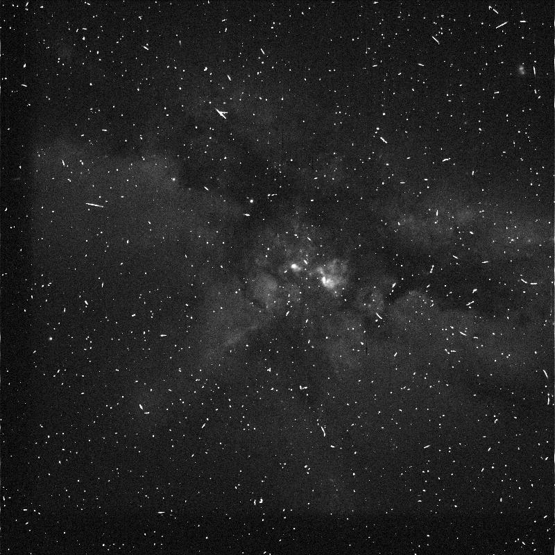

# hubble

Tools to access and process [Hubble Space Telescope imagery](https://registry.opendata.aws/hst/). 

---

```bash
hubble help
```

```bash
🪐 hubble-3.9.1

hubble download \
	[~dryrun,filename=<filename>|all,upload] \
	[<hubble-object-name>] \
	[<object-name>]
 . <hubble-object-name> -> <object-name>.
hubble list \
	[<object-name>]
 . list hubble.
hubble select \
	<object-name>
 . select a hubble object.

example object: public/u4ge/u4ge0106r/
 ```

---

```bash
abcli select hubble-download-val-2023-09-10-v5
hubble select public/u4ge/u4ge0106r/
hubble list .
hubble download ~dryrun,upload
open .
```



[details](https://arash-kamangir.medium.com/hubble-space-telescope-1-7857fe292698)
