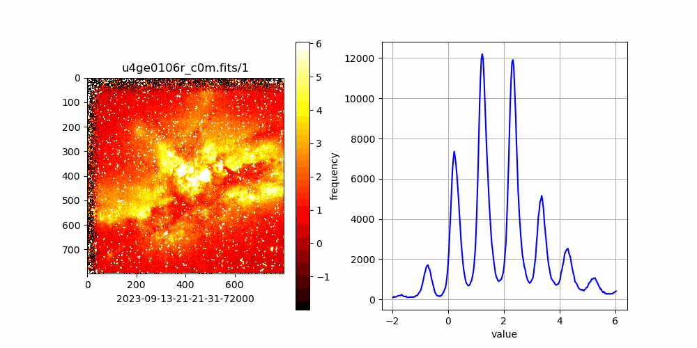
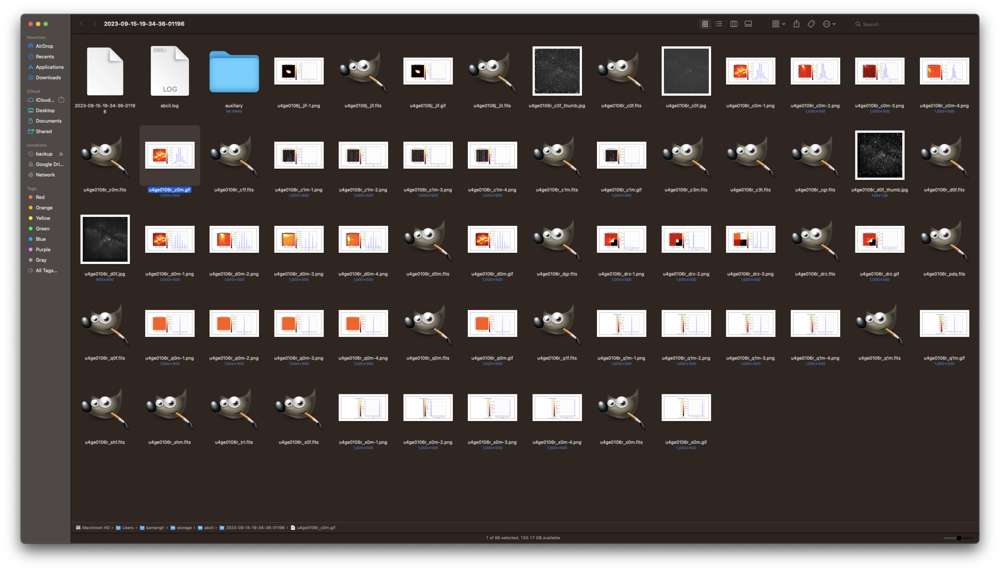

# 🔭 hubble (hubblescope)

`hubble` 🔭 is a set of tools to access and process [Hubble Space Telescope imagery](https://registry.opendata.aws/hst/) and other datasets on [AWS Open Data Registry](https://registry.opendata.aws/).

```bash
pip install hubblescope
```

```bash
 > hubble help
🔭 hubble-3.295.1
🔭 tools to access and process Hubble Space Telescope imagery and other datasets on AWS Open Data Registry.

hubble download \
	[~dryrun,filename=<filename>|all,~ingest,upload] \
	[.|<hubble-object-name>] \
	[.|<object-name>]
 . hst/<hubble-object-name> -> <object-name>.
hubble list [dataset] [.|<hubble-dataset-name>]
 . list <hubble-dataset-name>, example: hst.
hubble list [object] [.|<hubble-object-name>]
 . list <hubble-object-name> in hst, example in hst: public/u4ge/u4ge0106r.
hubble select [dataset] <hubble-dataset-name>
 . select <hubble-dataset-name>, example: hst.
hubble select [object] <hubble-object-name>
 . select <hubble-object-name> in hst, example in hst: public/u4ge/u4ge0106r.
```

`hubble` supports `list`ing `dataset`s and the `objects`s in them and downloading the `object`s. here is an example use for ingesting the object `public/u4ge/u4ge0106r` from the dataset [Hubble Space Telescope](https://registry.opendata.aws/hst/) (`hst`),

```bash
abcli select; open .
hubble select dataset hst
hubble select object public/u4ge/u4ge0106r
hubble download ~dryrun
```





also see [`notebooks/hst.ipynb`](./notebooks/hst.ipynb)

---

[](https://pypi.org/project/hubblescope/)
